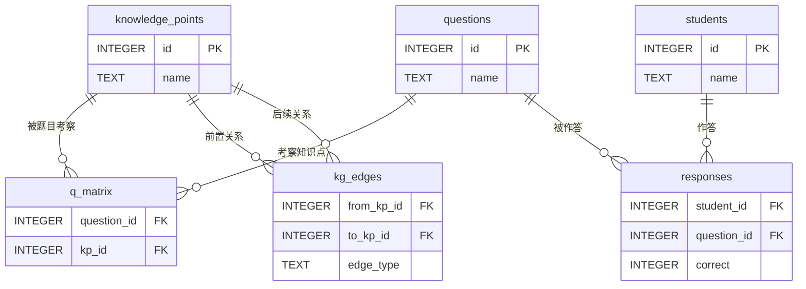

# 数据模型 ER 图

```mermaid
erDiagram
    knowledge_points ||--o{ q_matrix : "被题目考察"
    questions ||--o{ q_matrix : "考察知识点"
    students ||--o{ responses : "作答"
    questions ||--o{ responses : "被作答"
    knowledge_points ||--o{ kg_edges : "前置关系"
    knowledge_points ||--o{ kg_edges : "后续关系"

    knowledge_points {
        INTEGER id PK
        TEXT name
    }

    questions {
        INTEGER id PK
        TEXT name
    }

    students {
        INTEGER id PK
        TEXT name
    }

    q_matrix {
        INTEGER question_id FK
        INTEGER kp_id FK
    }

    responses {
        INTEGER student_id FK
        INTEGER question_id FK
        INTEGER correct
    }

    kg_edges {
        INTEGER from_kp_id FK
        INTEGER to_kp_id FK
        TEXT edge_type
    }
```

## 附加说明

- 共 **6 张表**，核心实体为 `knowledge_points` 和 `questions`
- `q_matrix` 实现**多对多关联**（题目考哪些知识点）
- `responses` 存储学生作答记录（0/1）
- `kg_edges` 存储知识图谱前置链
